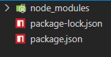
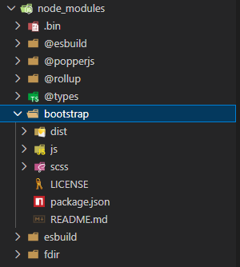
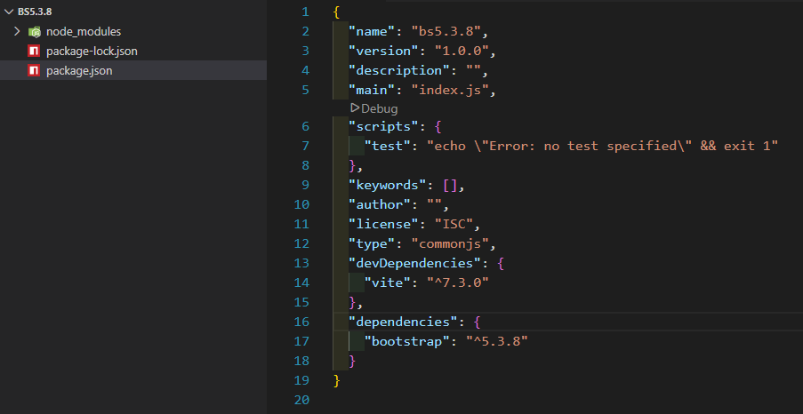

# Bootstab 5.3.8 with Vite
## Steps
- Download and Setup ( Node.js )
- Create you Folder 

      Create a project folder and set up npm. We'll create the my-project folder and initialize npm with the -y argument to avoid it asking us all the interactive questions.

      mkdir my-project && cd my-project
      npm init -y

- Install Vite

      Install Vite. Unlike our Webpack guide, there’s only a single build tool dependency here. We use --save-dev to signal that this dependency is only for development use and not for production.

      npm i --save-dev vite

    

- Install bootstrap

      Install Bootstrap. Now we can install Bootstrap. 

      npm install bootstrap

    

## packge.json File 

-   "devDependencies": {
    "vite": "^7.3.0"
  },

-   "dependencies": {
    "bootstrap": "^5.3.8"
  }

  

## Extensions
  - HTML CSS support
  - Live Server

